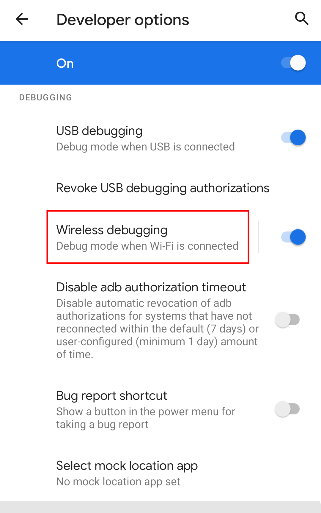
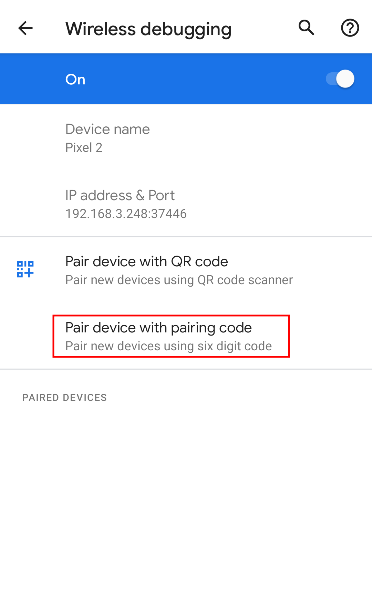
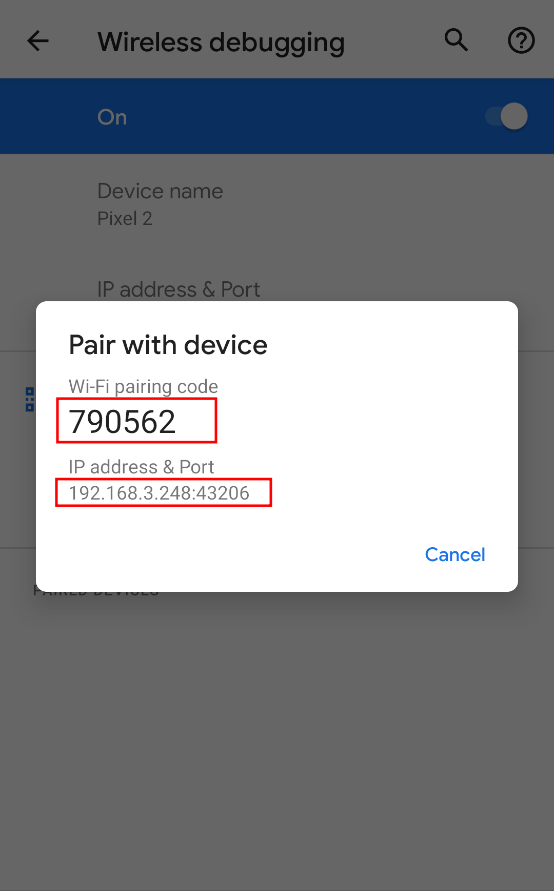
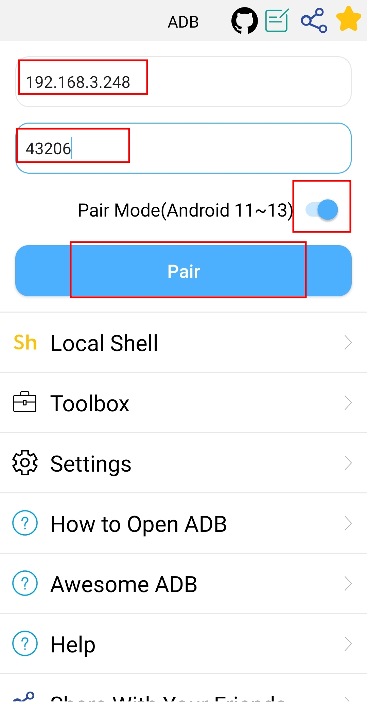
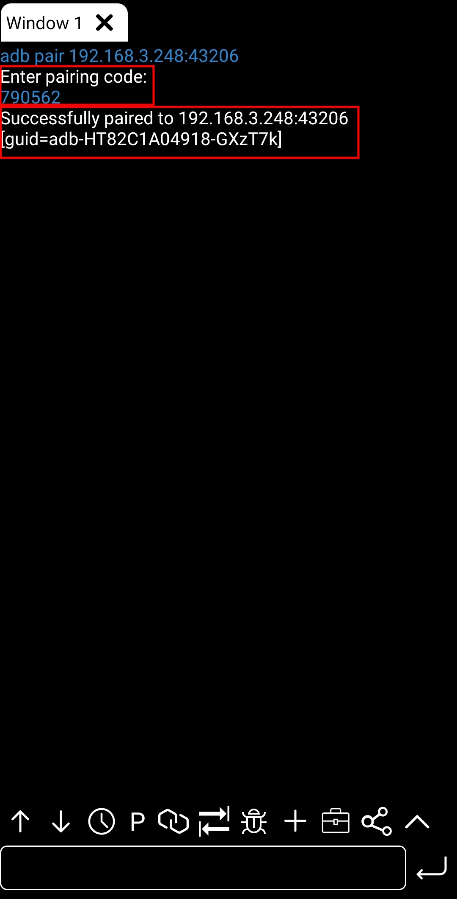
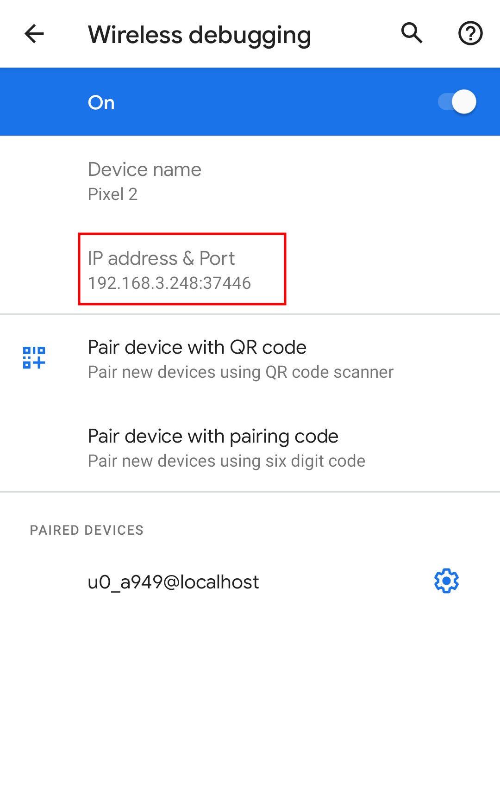
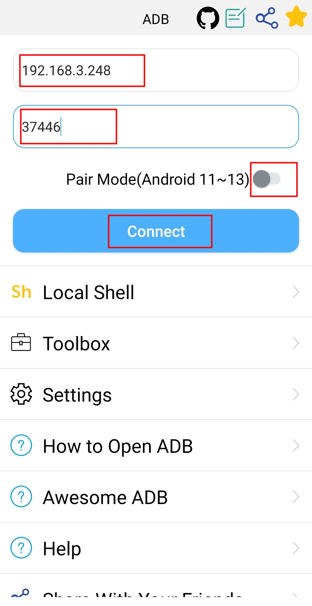
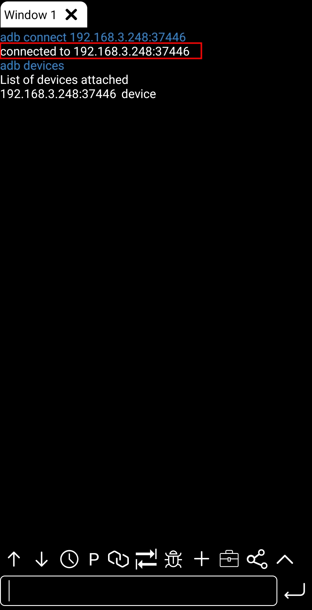

### How to pair and connect adb(Android 11 ~ Android 13)

##### Warning!!! If you use local adb, please don't use pairing mode. For local adb, please refer to [Connect adb (Android 4.x ~ Android 13)](./connectADB4x_13.md)

##### 1. Different models of phones may be slightly different!
##### 2. This tutorial generally requires two Android phones

1. [Open mobile adb(Android 11 ~ Android 13)](./md/../openMobileADB11_13.md)
2. Click 'Wireless debugging'
   - 
3. Click 'Pair device with pairing code'
   - 
   - 
4. 1. Open the adb app.
   2. Input IP and port.
   3. Enable pair mode.
   4. Click 'Pair'
   5. Input 'WiFi pairing code'
   - 
   - 
5. 1. Input IP and port.
   1. Disable pair mode.
   2. Click 'Connect'
   - 
   - 
   - 
