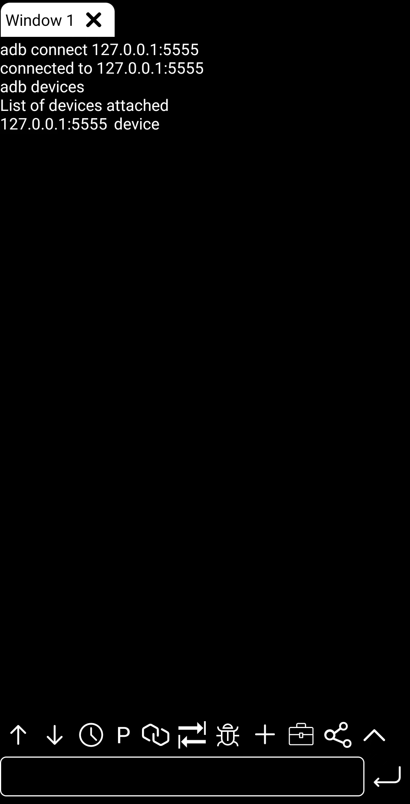

### How to connect adb(Android 4.x ~ Android 13)
#### 1. Different models of phones may be slightly different!
#### 2. This tutorial requires a PC

1. [open mobile adb](./md/../openMobileADB4x_13.md) or [open TV adb](./md/../openTVADB.md)
2. 1. Connect the USB cable.
   2. Open your PC shell or powershell and input
    ```
    $ adb devices
    List of devices attached
    HT********	device

    $ adb tcpip 5555
    restarting in TCP mode port: 5555

    $ adb disconnect
    disconnected everything
    ```
3. 1. Open the adb app
   2. Input IP and port
   3. disable pair mode
   4. Click 'connect'
   - 
   - 
   