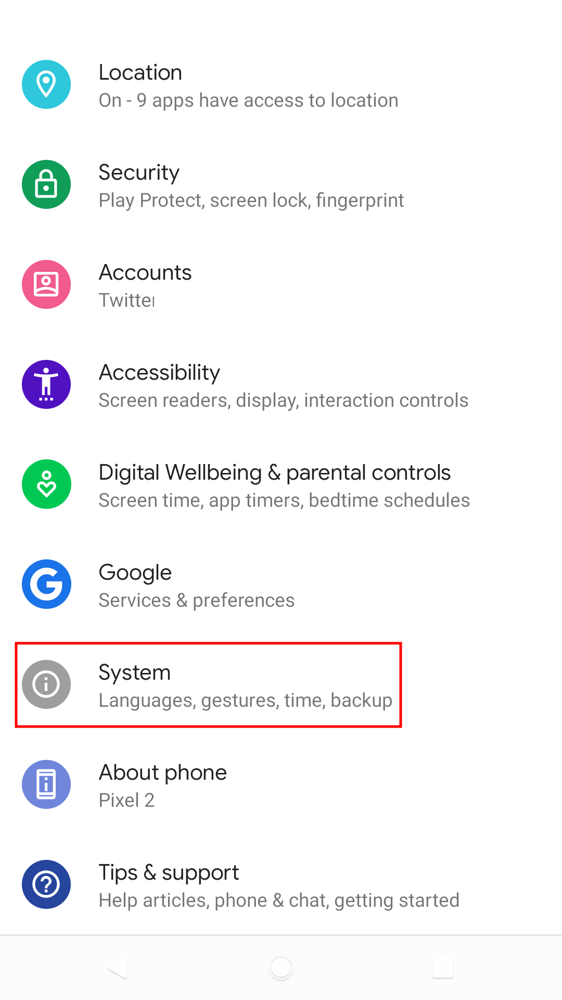
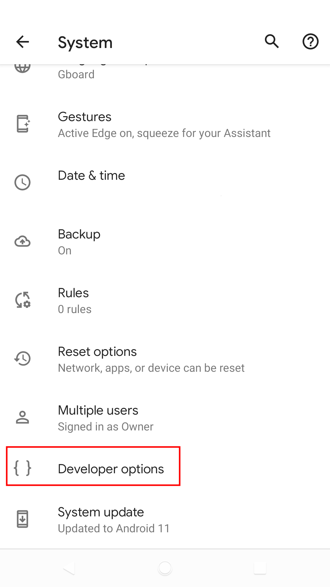
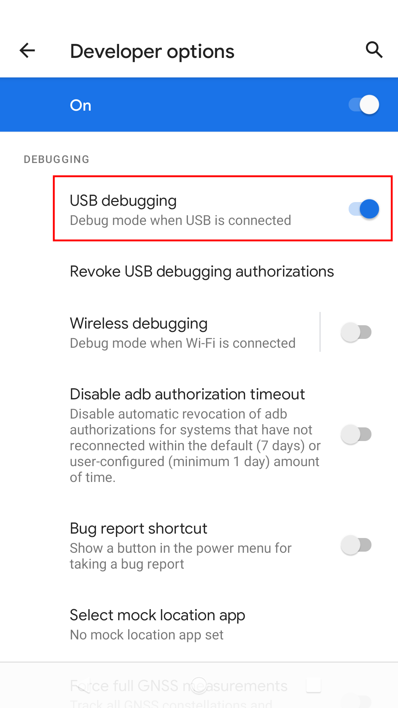
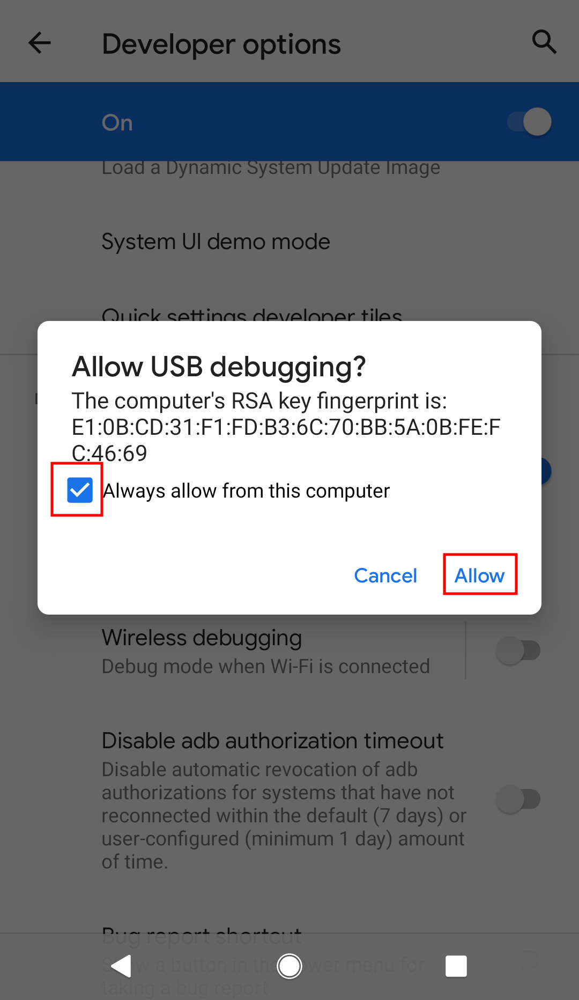
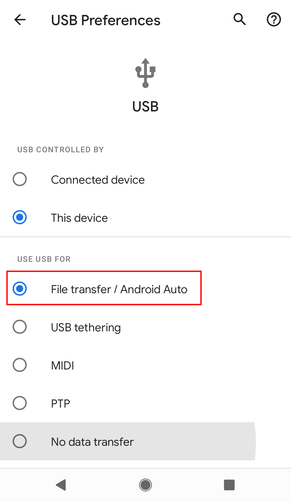

### How to open mobile ADB
##### 1. Different models of phones may be slightly different!
##### 2. This tutorial requires a PC


1. Open system setting app
2. Click 'About phone'
   - 

3. Click on 'Build number' until developer mode is enabled
   - 
   - 

4. Click 'System'
   - 

5. Click 'Developer options'
   - 
   - 

6. Enable 'USB debugging'
   - 

7. Click 'OK'
   - 

8. Allow ADB debugging in charge only mode (Optional)
9. Connect the USB cable.
10. Click 'Allow'
   - 

11. Click 'Notifications'.
12. Click 'Charging this device via USB'.
    - 

13. Click 'File transfer/Android Auto'
    - 
    
14. Open your PC shell or powershell and input 
    ```
    $ adb devices
    List of devices attached
    HT********	device

    $ adb tcpip 5555
    restarting in TCP mode port: 5555
    ```


