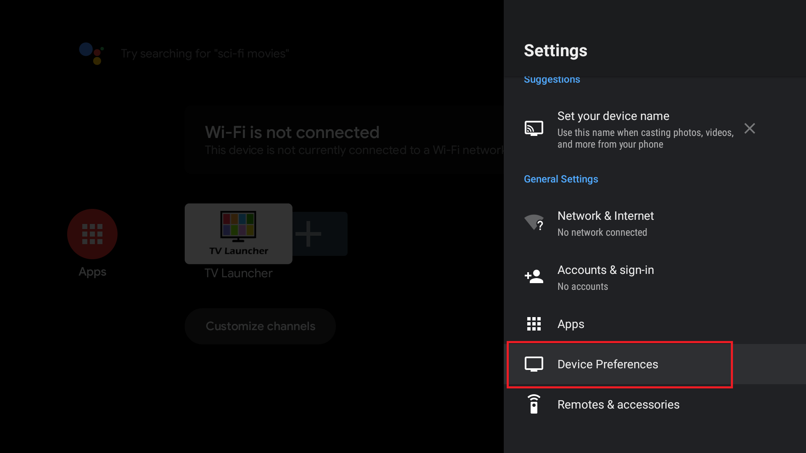
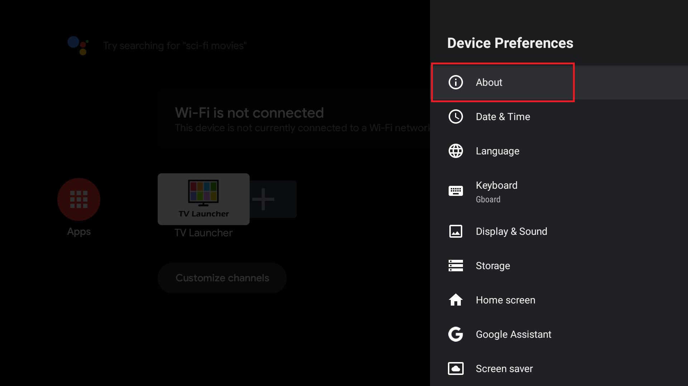
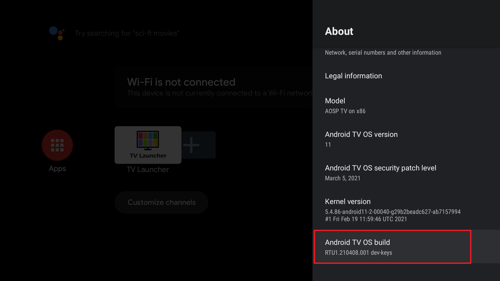
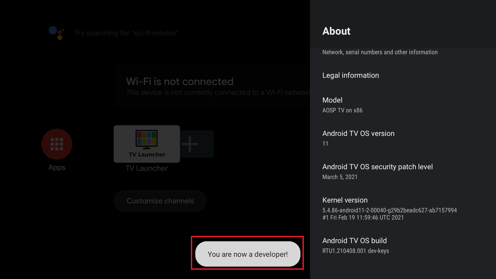
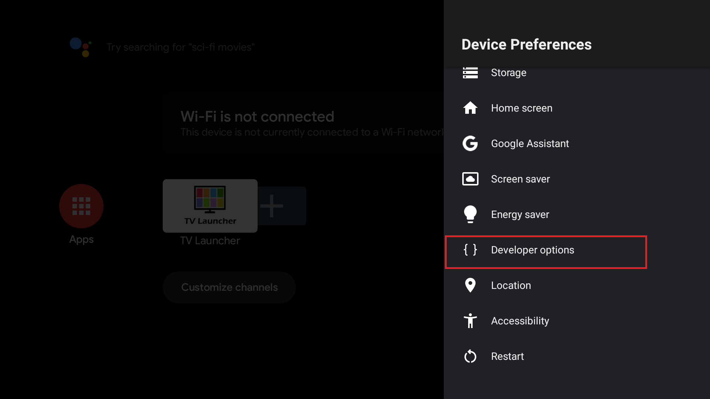
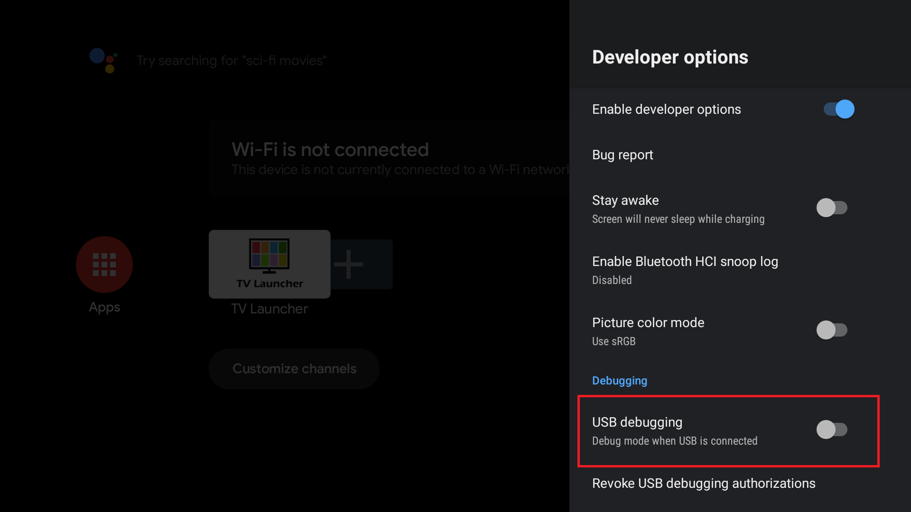
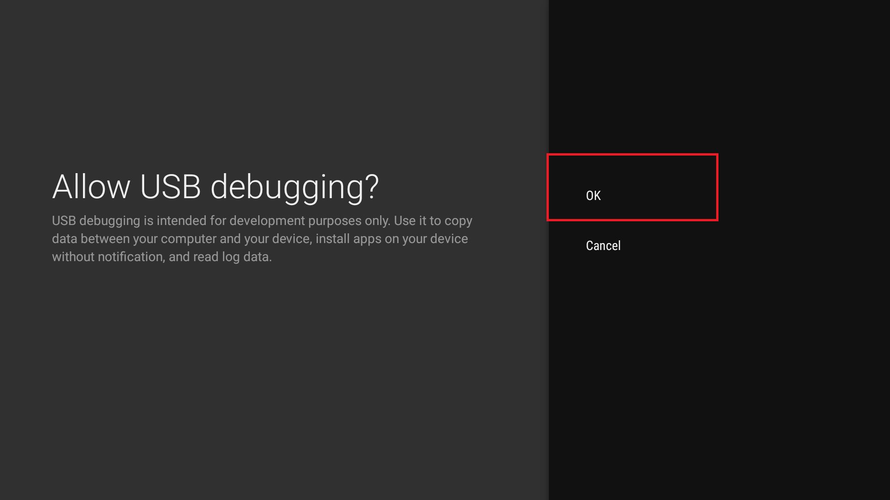
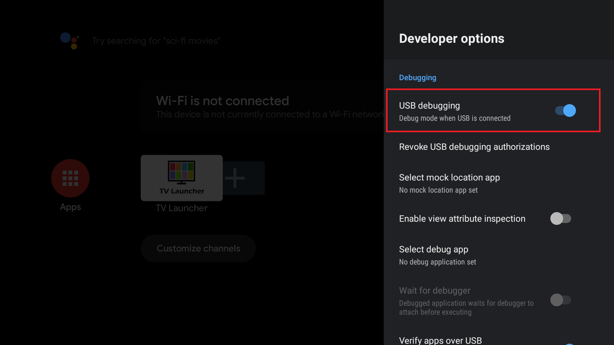

##### How to open mobile ADB
Different models of phones may be slightly different!
1. Open system setting app
2. Click 'Device Preferences'
   - 
3. Click 'About'
   - 

4. Click on 'Android TV OS build' or 'Build number' until developer mode is enabled
   - 
   - 

5. Click 'Developer options'
   - 

6. Enable 'USB debugging'
   - 

7. Click 'OK'
   - 
   - 

8.  Connect the USB cable.
9.  Open your PC shell or powershell and input 
    ```
    $ adb devices
    List of devices attached
    HT********	device

    $ adb tcpip 5555
    restarting in TCP mode port: 5555
    ```


