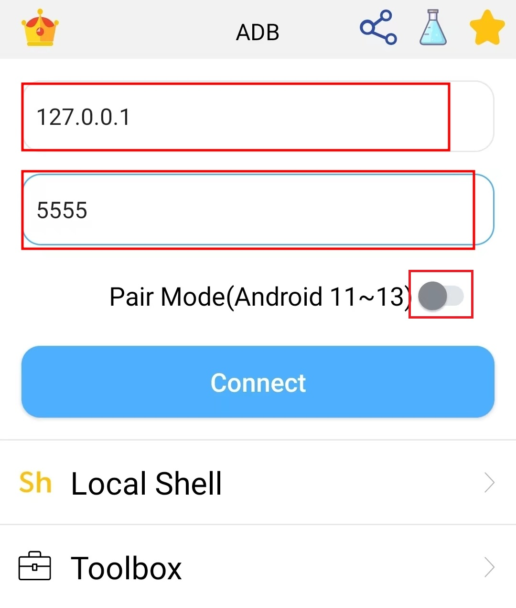

## Tutorials
### 💎💎💎💎💎💎 If the application is not working, please make sure to refer to the following tutorial. If you are a beginner or using this application for the first time, please make sure to refer to the following tutorial. If you have any questions, please refer to the following FAQ or contact us via email (colorboxguestservice@gmail.com).🍏🍎🍐🍊🍋🍌🍉🍇🍓🍈🍒🍑🥭🍍🥥🥝🍅
### ❤️How to open and connect adb ↓↓↓↓↓↓↓↓↓↓↓↓↓↓↓↓↓↓↓↓↓↓↓↓↓↓↓↓↓↓↓↓↓↓↓↓↓↓↓↓↓↓↓↓↓↓↓↓↓↓↓↓
- [⚡Open and connect adb(From google)](https://developer.android.com/studio/command-line/adb)
- [👍Connect adb (Android 4.x ~ Android 13)](./connectADB4x_13.md)
- [Pair and connect adb (Android 11 ~ Android 13)](./connectADB11_13.md)
- [👍Open mobile adb(Android 4.x ~ Android 13)](./openMobileADB4x_13.md)
- [Open mobile adb(Android 11 ~ Android 13)](./openMobileADB11_13.md)
- [Open TV/TV Box adb](./openTVADB.md)

### FAQ directory
1. [32 or 64 bit libraries?](#32-or-64-bit-libraries)
2. [Ｍy phone is (Android 5/6/7/8/9/10/11/12/13/14), can you provide me with a tutorial?](#my-phone-is-android-567891011121314-can-you-provide-me-with-a-tutorial)
3. [Failed: Unable to start pairing client](#failed-unable-to-start-pairing-client)
4. [How to use this app locally?](#how-to-use-this-app-locally)
5. [*lib/arm/libfs.so inaccessible or not found.](#libarmlibfsso-inaccessible-or-not-found)
6. [error: device unauthorized.This adb server\'s $ADB_VENDOR_KEYS is not set](#error-device-unauthorizedthis-adb-servers-adb_vendor_keys-is-not-set)
7. [error: more than one device/emulator](#error-more-than-one-deviceemulator)
8. [sh:<stdin> ** inaccessible or not found](#sh--inaccessible-or-not-found)
9. [I don't have a PC, how can I use this application locally?](#i-dont-have-a-pc-how-can-i-use-this-application-locally)
10. [Is this app malware?](#is-this-app-malware)
11. [I suspect that my phone has been hacked. I suspect that my phone has malicious software. I suspect that my phone is being monitored by (my neighbor/ex-girlfriend/ex-boyfriend/boss/colleague/etc).](#i-suspect-that-my-phone-has-been-hacked-i-suspect-that-my-phone-has-malicious-software-i-suspect-that-my-phone-is-being-monitored-by-my-neighborex-girlfriendex-boyfriendbosscolleagueetc)
12. [Why does this app require storage permission?](#why-does-this-app-require-storage-permission)
13. [Why is it not possible to grant executable permission to files in /sdcard? chmod 777 /sdcard/*.sh,not working.](#why-is-it-not-possible-to-grant-executable-permission-to-files-in-sdcard-chmod-777-sdcardshnot-working)
14. [ADB connection takes too long.](#adb-connection-takes-too-long)
15. [ADB connection is unstable.](#adb-connection-is-unstable)
16. [ADB is already connected but cannot execute commands.](#adb-is-already-connected-but-cannot-execute-commands)
17. [ADB is already connected but toolbox cannot be initialized.](#adb-is-already-connected-but-toolbox-cannot-be-initialized)
18. [failed to start daemon.cannot connect to daemon adb reboot.ADB server didn't ACK](#failed-to-start-daemoncannot-connect-to-daemon-adb-rebootadb-server-didnt-ack)
19. [Just keeps showing app info in Android settings. Not working.](#just-keeps-showing-app-info-in-android-settings-not-working)
20. [can't execute: Permission denied](#cant-execute-permission-denied)
21. [I hope to use this application to monitor someone else's phone and invade their privacy.](#i-hope-to-use-this-application-to-monitor-someone-elses-phone-and-invade-their-privacy)
22. [I want to use this app to hack my (colleague/ex-girlfriend/ex-boyfriend/neighbor etc.)](#i-want-to-use-this-app-to-hack-my-colleagueex-girlfriendex-boyfriendneighbor-etc)
23. [This app not working.](#this-app-not-working)
24. [Unable to connect, not working properly.](#unable-to-connect-not-working-properly)
25. [I don't know the pairing passcode, and I can't enter it in the settings. I can't use pairing mode.](#i-dont-know-the-pairing-passcode-and-i-cant-enter-it-in-the-settings-i-cant-use-pairing-mode)
26. [Execute commands too slowly](#execute-commands-too-slowly)
27. [Why does my phone have this app?](#why-does-my-phone-have-this-app)
28. [Why is backing up APK and installing APK not supported now?](#why-is-backing-up-apk-and-installing-apk-not-supported-now)
29. [The command cannot be executed, or it is not functioning properly, or the command is not working.](#the-command-cannot-be-executed-or-it-is-not-functioning-properly-or-the-command-is-not-working)
30. [What should I do if an exception occurs when using a certain feature?](#what-should-i-do-if-an-exception-occurs-when-using-a-certain-feature)
31. [I want to learn adb](#i-want-to-learn-adb)

### FAQ list
1. #### 32 or 64 bit libraries?
   - Default:32-bit.32-bit library compatibility is stronger.
   - 64-bit libraries are more stable.
   - 64-bit libraries are faster.If it takes too long to connect the device, you can try to switch the 64-bit library.
   - 64-bit libraries are recommended for Android 11 and above.

2. #### My phone is (Android 5/6/7/8/9/10/11/12/13/14), can you provide me with a tutorial?
   If your browser is working properly, you should be able to see our tutorial on this page. The tutorial is located at the top.
   
4. #### Failed: Unable to start pairing client.
   1. 🥝 It is usually due to incorrect pairing of ports or IP addresses. Please check the paired IP and port! Refer to [Pair and connect adb (Android 11 ~ Android 13)](./connectADB11_13.md)
   2. If it still doesn't work, you can try to switch the 64-bit library in the settings.
   3. If it still doesn't work, you can try to switch to another connection mode. [👍Connect adb (Android 4.x ~ Android 13)](./connectADB4x_13.md)


5. #### How to use this app locally?
   1. Open and connect adb.[How to open and connect adb](#how-to-open-and-connect-adb)
   2. Disable pairing mode.
   3. Default IP 127.0.0.1 and default port 5555 is local mode.
      - 

6. #### *lib/arm/libfs.so inaccessible or not found.
   - Solution 1:Click reset the app.
   - Solution 2:Reinstall the app.

7. #### error: device unauthorized.This adb server\'s $ADB_VENDOR_KEYS is not set
   - Solution 1:Click restart app.
   - Solution 2:
   ```
    $ adb kill-server
    $ adb start-server
      * daemon not running; starting now at tcp:5037
      * daemon started successfully
   ```

8. #### error: more than one device/emulator
   Input \"adb devices\".Use \"adb -s IP:PORT\" select a specific device.
   ```
   $ adb devices
     List of devices attached
     192.168.3.100:5556      device
     192.168.3.101:5555      device
   $ adb -s 192.168.3.101:5555 shell
     console:/ $
   ```
9. #### sh:<stdin>[] ** inaccessible or not found
   - Please confirm that the command you entered is correct.

10. #### I don't have a PC, how can I use this application locally?
    1. Refer to [Pair and connect adb (Android 11 ~ Android 13)](./connectADB11_13.md)
    2. Then open the network port(Must be connected state)
      ```
      $ adb devices
        List of devices attached
        192.168.3.100:5556      device
      $ adb tcpip 5555
      ```
    3. Refer to [How to use this app locally?](#how-to-use-this-app-locally)

11. #### Is this app malware?
    This application is an ADB development tool, not a malicious software. If your phone has been compromised, please check if there are any other malicious software on your device.

12. #### I suspect that my phone has been hacked. I suspect that my phone has malicious software. I suspect that my phone is being monitored by (my neighbor/ex-girlfriend/ex-boyfriend/boss/colleague/etc).
    In most cases, as long as your phone is not rooted, it is unlikely to be hacked/monitored. However, there may still be malicious software present. It is recommended to download professional antivirus software. If you are very concerned, you can try resetting your phone (remember to save your important data such as photos and contacts, etc.).Change passwords: Update the passwords for all your accounts, including email, social media, and banking apps. Use strong, unique passwords for each account.

13. #### Why does this app require storage permission?
    1. The command 'ls'.
    2. 'Local file' in the toolbox.
    3. Saving screenshots.
    4. App logs.
    And so on, all require storage permission.

14. #### Why is it not possible to grant executable permission to files in /sdcard? chmod 777 /sdcard/*.sh,not working.
    For security reasons, the Android operating system does not allow granting executable permissions to files in the /sdcard (or external storage) by default. This is done to prevent potential security risks and to protect user devices from malicious software or apps abusing permissions. 
    ##### Solution:You can copy the file to the /data/local/tmp/ directory, which allows granting executable permissions.
    ```
    cp YOUR_FILE /data/local/tmp/
    ```

15. #### ADB connection takes too long.
    1. Please check if your internet is working properly.
    2. Try restarting this application or resetting it (located at the bottom of this application's settings).This method is the simplest and most effective.
16. #### ADB connection is unstable.
    1. Please check if your internet is working properly.
    2. Try restarting this application or resetting it (located at the bottom of this application's settings).This method is the simplest and most effective.
17. #### ADB is already connected but cannot execute commands.
    1. Please check if your internet is working properly.
    2. Try restarting this application or resetting it (located at the bottom of this application's settings).This method is the simplest and most effective.
18. #### ADB is already connected but toolbox cannot be initialized.
    1. Please check if your internet is working properly.
    2. Try restarting this application or resetting it (located at the bottom of this application's settings).This method is the simplest and most effective.
19. #### failed to start daemon.cannot connect to daemon adb reboot.ADB server didn't ACK
    1. Click 'Settings'.
    2. Click 'Port of adb server'
    3. Modify port (3000-49151)

20. #### Just keeps showing app info in Android settings. Not working.
    The issue has been fixed, please upgrade to the latest version.

21. #### can't execute: Permission denied
    For security reasons, the Android operating system does not allow granting executable permissions to files in the /sdcard (or external storage) by default. This is done to prevent potential security risks and to protect user devices from malicious software or apps abusing permissions. 
    ##### Solution:You can copy the file to the /data/local/tmp/ directory, which allows granting executable permissions.
    ```
    cp YOUR_FILE /data/local/tmp/
    ```

22. #### I hope to use this application to monitor someone else's phone and invade their privacy.
    ##### Not support!!!!!

23. #### I want to use this app to hack my (colleague/ex-girlfriend/ex-boyfriend/neighbor etc.)
    ##### Not support!!!!!

24. #### This app not working.
    This application has been tested. In most cases, if you have any questions about using this app,please Refer to [How to open and connect adb](#how-to-open-and-connect-adb)

25. #### Unable to connect, not working properly.
    This application has been tested. In most cases, if you have any questions about using this app,please Refer to [How to open and connect adb](#how-to-open-and-connect-adb)

26. #### I don't know the pairing passcode, and I can't enter it in the settings. I can't use pairing mode.
    This application has been tested. In most cases, if you have any questions about using this app,please Refer to [Pair and connect adb (Android 11 ~ Android 13)](#how-to-open-and-connect-adb)
27. #### Execute commands too slowly
    The execution speed of the command depends on the performance of your mobile phone.

28. #### Why does my phone have this app?
    This application is not malicious software. If you have not downloaded this application, please uninstall it.

29. #### Why is backing up APK and installing APK not supported now?
    - Install applications will not be supported anymore due to Google policy
    - Refer to https://support.google.com/googleplay/android-developer/answer/9888379
    - Install applications is a very important feature, and we may consider implementing this feature in a different way.😀
30. #### The command cannot be executed, or it is not functioning properly, or the command is not working.
    Every Android system is different, and so is the compatibility. Please check if your command is correct.
31. #### What should I do if an exception occurs when using a certain feature?
    We are committed to providing you with excellent service and look forward to hearing from you.If you have any questions,please contact the developers first.Email:colorboxguestservice@gmail.com
32. #### I want to learn adb
    - [Google adb details](https://developer.android.com/studio/command-line/adb)
    - [awesome-adb](https://github.com/mzlogin/awesome-adb/blob/master/README.en.md)
