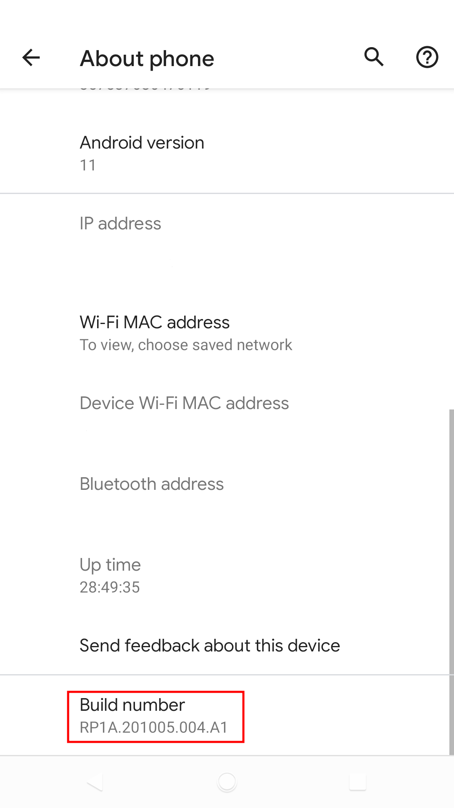
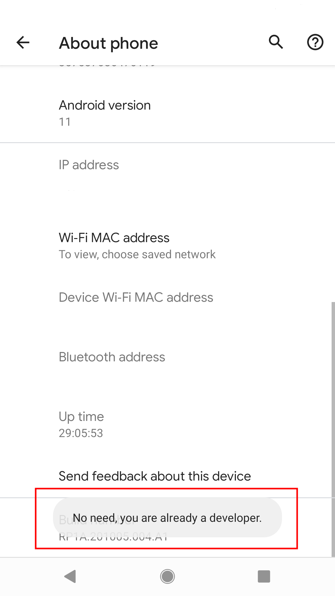
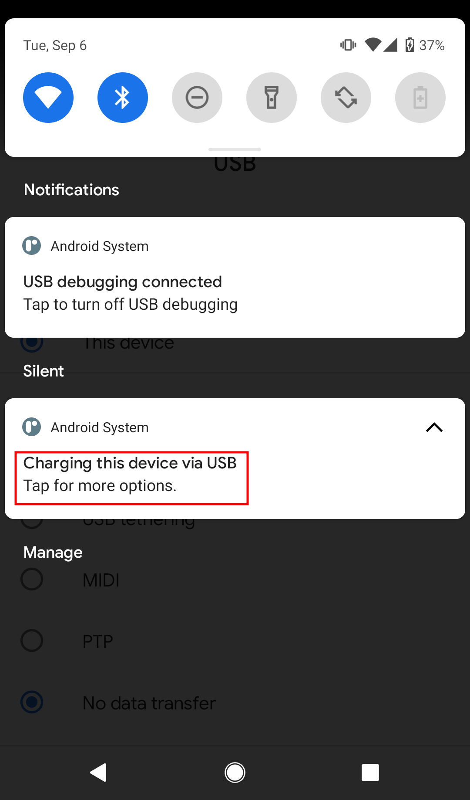

##### How to open mobile ADB
Different models of phones may be slightly different!
1. Open system setting app
2. Click 'About phone'
   - 

3. Click on 'Build number' until developer mode is enabled
   - 
   - 

4. Click 'System'
   - 

5. Click 'Developer options'
   - 
   - 

6. Enable 'USB debugging'
   - 

7. Click 'OK'
   - 

8. Connect the USB cable.
9. Click 'Allow'
   - 

10. Click 'Notifications'.
11. Click 'Charging this device via USB'.
    - 

12. Click 'File transfer/Android Auto'
    - 
    
13. Open your PC shell or powershell and input 
    ```
    $ adb devices
    List of devices attached
    HT********	device

    $ adb tcpip 5555
    restarting in TCP mode port: 5555
    ```


